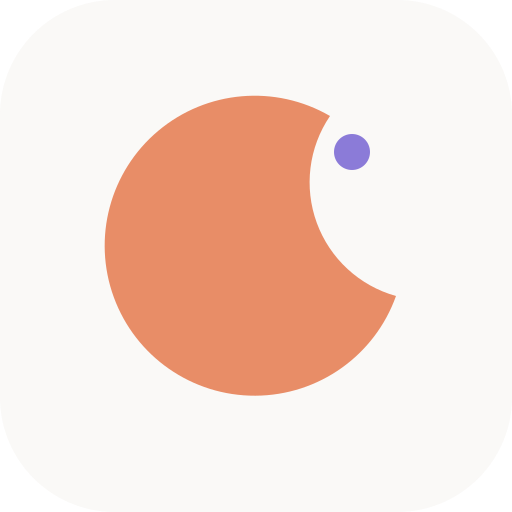

<div align="center">
  

  # Pjokk

  **A calm, self-hosted baby tracker for families.**

  *"en liten pjokk" — a little tyke*

  [pjokk.no](https://pjokk.no) · [API docs](https://pjokk.no/api/docs)
</div>

---

## What it solves

New parents look at a tracker far more often than they write to it — usually
one-handed, at 03:00, holding a baby. Pjokk is built around that reality:

- **Status before action.** The home screen answers *"when did she last eat /
  sleep / get changed"* in relative time ("2 h ago"), with zero taps.
- **Five-second logging.** Open sheet → save. Everything is prefilled from the
  last entry; amounts use steppers and chips, never the OS keyboard.
- **Retroactive by default.** Every time field offers *Now / 15 m ago / Pick
  time*, because nobody logs mid-feed.
- **Night mode as a first-class citizen.** Between 22:00 and 07:00 the app
  turns near-black and amber with three big actions in the bottom half of the
  screen — no blue light, no hunting for buttons.
- **A family, not an account.** Caretakers share one family (multi-tenant to
  the bone), join via QR invite codes at the Sunday dinner table, and every
  timeline entry says who logged it. Signup is invite-only.
- **Works in the dead zone.** Offline-first PWA: the last known state renders
  instantly, and entries logged without signal sync when it returns.

It is a from-scratch replacement for
[sprout-track](https://github.com/Oak-and-Sprout/sprout-track), rebuilt
mobile-first and running entirely on Cloudflare's edge — one deploy, no
servers to babysit (the baby is enough).

## How it's built

One Cloudflare Worker serves the public landing page at `/`, the SPA from
`/home` onwards, and the API under `/api`.

| Layer | Choice |
|---|---|
| Runtime | Cloudflare Workers (single Worker: static assets + API) |
| API | Hono + `@hono/zod-openapi` — zod schemas drive validation, OpenAPI (Scalar at `/api/docs`), and the typed RPC client |
| Data | Drizzle ORM + D1 (SQLite), R2 for files, KV for rate limiting |
| Auth | better-auth — Google + email/passkey, Organizations plugin (an organization *is* a family), invite-code redeem as the only signup door |
| Frontend | Vite + React, TanStack Router/Query, Tailwind + shadcn-style components, vaul bottom sheets |
| Offline | TanStack Query persisted to IndexedDB + paused-mutation queue; Workbox PWA with update toast |
| Tests | `@cloudflare/vitest-pool-workers` — tenancy, invite redeem, and sleep-session logic tested in the real Workers runtime |

Every domain table carries a `familyId`, and all data access flows through
family-scoped query helpers behind a tenancy middleware — cross-family access
is structurally impossible, and tested to stay that way.

## Development

```sh
pnpm install
pnpm db:migrate:local   # apply migrations to the local D1
pnpm seed:local         # demo family, baby Nora, a realistic day of logs
pnpm dev                # http://localhost:5173
```

Sign in locally with `anders@pjokk.local` / `pjokk-dev`.

```sh
pnpm test               # vitest in the Workers runtime
pnpm check              # typecheck web + worker
pnpm deploy             # build + wrangler deploy
```

Copy `.dev.vars.example` to `.dev.vars` for local secrets; production secrets
are set with `wrangler secret put` (see `SMOKE-TEST.md`).

## Repository layout

```
src/shared/    zod schemas — the single source of truth for API shapes
src/worker/    Hono API, better-auth factory, tenancy middleware, Drizzle schema
src/web/       React SPA (screens, log sheets, offline plumbing)
migrations/    D1 migrations (drizzle-kit)
test/          workers-runtime tests
```

`CLAUDE.md` is the project constitution (product principles, stack decisions,
roadmap). `DECISIONS.md` logs the boring choices made along the way. Phase 1
(the core loop) is live; timeline, stats, more activity types, and push
notifications follow in later phases.
